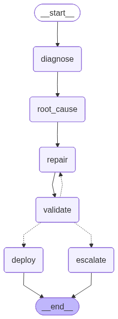

# 🏠 HA YAML Repair Agent

A fully autonomous multi-agent system that monitors Home Assistant for broken
automations, diagnoses the root cause using a local LLM, rewrites the YAML,
validates it, and redeploys — all without human intervention.

## Architecture



```
Supervisor (main.py)
└── watches HA WebSocket for automation failures
    └── fires LangGraph repair workflow per failure:

        DiagnosticsAgent   → fetches YAML + logs + known entity IDs
        RootCauseAgent     → LLM reasons about why it broke + diffs stale entities
        YAMLRepairAgent    → LLM rewrites the automation YAML
        ValidatorAgent     → local structural checks + HA dry-run
             │
             ├── valid   → deploy (write + reload HA) → ✅
             ├── invalid → retry YAMLRepairAgent (up to MAX_REPAIR_ATTEMPTS)
             └── max retries → escalate (log for human review) → ⚠️
```

## Setup

### 1. Install dependencies
```bash
pip install -r requirements.txt
```

### 2. Configure your LLM endpoint
- Use any OpenAI-compatible REST API — local or cloud-hosted:
  - **Local**: LM Studio, Ollama, vLLM, llama.cpp server, etc.
  - **Cloud**: OpenAI, Azure OpenAI, Google Gemini (via OpenAI-compat), Groq, Together AI, etc.
- Note the base URL and model name for your `.env`

### 3. Configure environment
```bash
cp .env.example .env
# Edit .env with your HA URL, token, and LM Studio settings
```

### 4. Run
```bash
python main.py
```

## Environment Variables

| Variable            | Default                        | Description                            |
|---------------------|--------------------------------|----------------------------------------|
| `HA_URL`            | `http://homeassistant.local:8123` | Home Assistant base URL             |
| `HA_TOKEN`          | *(required)*                   | Long-lived HA access token             |
| `LLM_BASE_URL`      | *(required)*                   | OpenAI-compatible API base URL (local or cloud) |
| `LLM_MODEL`         | *(required)*                   | Model identifier for your chosen endpoint       |
| `MAX_REPAIR_ATTEMPTS` | `3`                          | Max self-correction loops per failure  |
| `AUTOMATIONS_DIR`   | `/config/automations`          | Path to HA automation YAML files       |

## Getting a Home Assistant Token

1. Open HA → Profile → Security → Long-Lived Access Tokens
2. Create a token and paste it into your `.env`

## Extending

- **Add a Notification Agent**: ping you on Slack/Telegram when a repair is deployed or escalated
- **Add Memory**: persist repair history to SQLite so the agent learns from past fixes
- **Add the Energy Optimizer**: layer Option A from the project ideas on top of this supervisor
